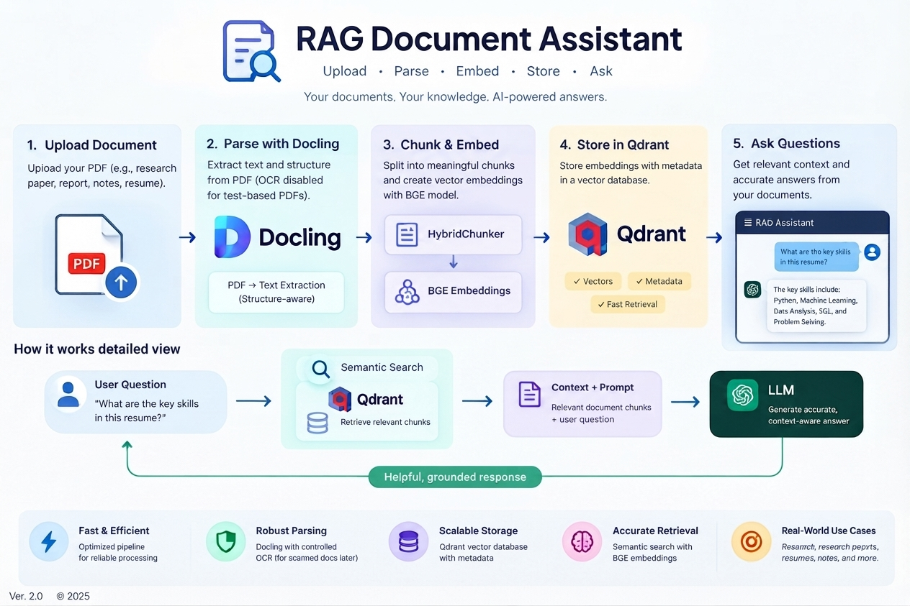
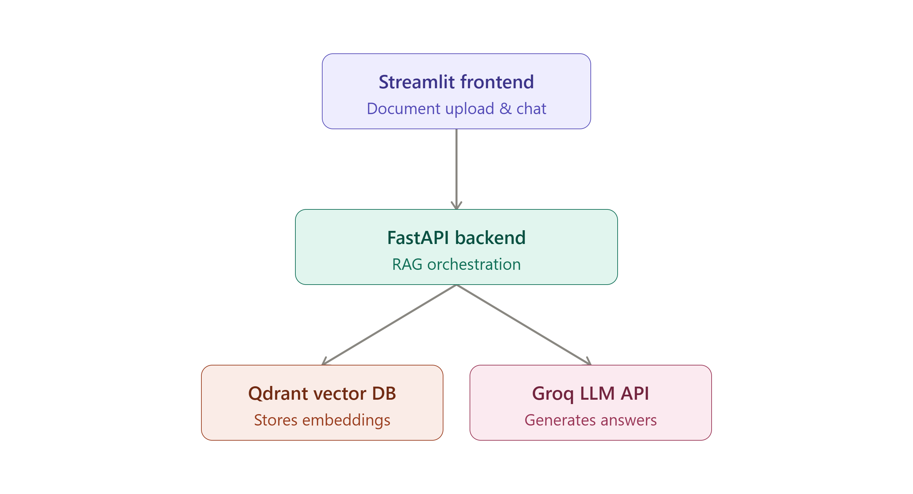
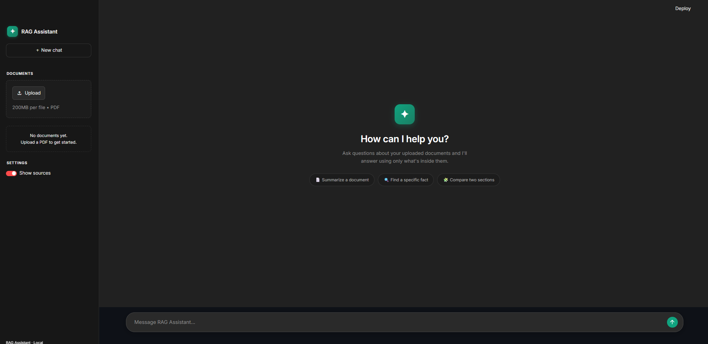
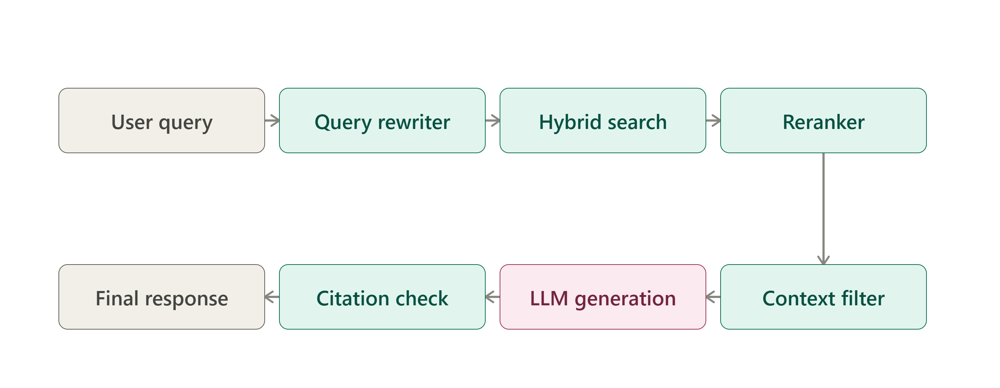

<p align="center">
  
</p>

<h1 align="center">RAG-App</h1>

<p align="center">
  A Retrieval-Augmented Generation (RAG) chatbot that lets you upload documents and ask questions grounded in their content — with hybrid search, reranking, query rewriting, and citation verification built in.
</p>

<p align="center">
  
  
  
  
  
</p>

---

## Overview

RAG-App is a full-stack Retrieval-Augmented Generation system. Users upload documents through a Streamlit frontend, which are chunked and embedded by a FastAPI backend, stored in a Qdrant vector database, and retrieved using a hybrid (keyword + vector) search pipeline. Retrieved chunks are reranked, filtered for relevance, and passed to an LLM to generate answers — with a citation verification step to keep responses grounded in the source documents.

<!-- 📸 IMAGE 1: Architecture diagram -->
<p align="center">
  
</p>

## Features

- **Document ingestion pipeline** — upload, chunk, and embed documents for retrieval
- **Hybrid search** — combines keyword (BM25) and vector similarity search
- **Reranking** — reorders retrieved chunks for relevance before generation
- **Query rewriting** — reformulates user queries to improve retrieval quality
- **Context filtering** — trims irrelevant retrieved content before it reaches the LLM
- **Citation verification** — checks that generated answers are actually supported by retrieved sources
- **Conversation memory** — maintains chat history across a session
- **Evaluation module** — scripts to benchmark retrieval/answer quality against a test dataset
- **Dockerized** — backend and frontend can be run in containers

## Tech Stack

| Layer            | Technology |
|-------------------|------------|
| Frontend          | Streamlit |
| Backend           | FastAPI |
| Vector Database   | Qdrant |
| LLM Inference     | Groq |
| Embeddings        | multilingual Sentence Transformer embedding model |
| Containerization  | Docker |
| Package Management| uv / pyproject.toml |

## Demo

<!-- 📸 IMAGE 2: App screenshot or GIF of the chat UI in action -->
<p align="center">
  
</p>

## Project Structure

```
RAG-App/
├── backend/
│   ├── api/
│   │   ├── chat.py            # Chat endpoint
│   │   ├── document.py        # Document management endpoints
│   │   └── upload.py          # File upload endpoint
│   ├── db/
│   │   └── qdrant.py          # Qdrant client/connection setup
│   ├── evaluation/
│   │   ├── dataset.py         # Evaluation dataset handling
│   │   └── evaluate.py        # Evaluation pipeline
│   ├── ingestion/
│   │   ├── chunker.py         # Document chunking logic
│   │   ├── embedder.py        # Embedding generation
│   │   └── pipeline.py        # End-to-end ingestion pipeline
│   ├── memory/
│   │   └── history.py         # Conversation/chat history
│   ├── rag/
│   │   ├── citation_verifier.py  # Verifies answers against sources
│   │   ├── context_filter.py     # Filters retrieved context
│   │   ├── pipeline.py           # Core RAG pipeline
│   │   └── query_rewriter.py     # Query rewriting
│   ├── retrieval/
│   │   ├── hybrid_search.py   # Combines keyword + vector search
│   │   ├── keyword_search.py  # BM25 keyword search
│   │   ├── rerank.py          # Reranking retrieved chunks
│   │   ├── retriever.py       # Retrieval orchestration
│   │   └── vector_search.py   # Vector similarity search
│   ├── main.py                # FastAPI app entrypoint
│   ├── Dockerfile
│   └── requirements.txt
├── frontend/                  # Streamlit app
├── pyproject.toml
├── uv.lock
└── README.md
```

<!-- 📸 IMAGE 3: Optional — data flow / sequence diagram of a single query -->
<p align="center">
  
</p>

## Getting Started

### Prerequisites

- Python 3.13 
- [uv](https://github.com/astral-sh/uv) (or pip)
- Docker (optional, for containerized setup)
- API keys: `GROQ_API_KEY`  `QDRANT_URL`, `QDRANT_API_KEY`

### 1. Clone the repository

```bash
git clone https://github.com/dipesh-bhattarai/RAG-App.git
cd RAG-App
```

### 2. Set up environment variables

Create a `.env` file in the backend directory:

```env
GROQ_API_KEY=your-groq-api-key
QDRANT_URL=your-qdrant-url
QDRANT_API_KEY=your-qdrant-api-key
```

### 3. Run with Docker

```bash
docker build -t rag-app-backend ./backend
docker run -p 8000:8000 --env-file backend/.env rag-app-backend
```

### 4. Run locally (without Docker)

**Backend:**
```bash
cd backend
uv sync            # or: pip install -r requirements.txt
uvicorn main:app --reload
```

**Frontend:**
```bash
cd frontend
streamlit run app.py
```

The backend will be available at `http://localhost:8000` and the Streamlit UI at `http://localhost:8501`.

## Usage

1. Launch the backend and frontend as described above.
2. Upload a document (PDF, DOCX, etc.) through the Streamlit interface.
3. Ask a question — the app retrieves relevant chunks, reranks them, and generates a grounded answer with citations.

## Evaluation

The `backend/evaluation/` module includes scripts to benchmark retrieval and answer quality against a test dataset. Run it with:

```bash
python -m backend.evaluation.evaluate
```

<!-- *(Add details on what metrics this reports, e.g. retrieval precision/recall, citation accuracy, etc.)* -->

## Future Improvements

- [ ] Deploy a hosted demo
- [ ] Add support for more document formats
- [ ] Add authentication for multi-user usage
- [ ] Expand automated evaluation coverage

<!-- ## License -->

